> 本文将详细介绍如何使用 quantWF_2.0 框架完成从数据预处理到功能富集的完整定量组学分析流程。通过实战案例，帮助读者快速掌握该框架的使用方法。

## 目录

1. [引言](#引言)
2. [分析流程概览](#分析流程概览)
3. [环境准备](#环境准备)
4. [实战案例1: 标准RNA-seq差异表达分析（无批次）](#实战案例1-标准rna-seq差异表达分析无批次)
5. [实战案例2: 含批次效应的RNA-seq分析](#实战案例2-含批次效应的rna-seq分析)
6. [实战案例3: 质谱蛋白质组学分析](#实战案例3-质谱蛋白质组学分析)
7. [实战案例4: QTL分析数据准备](#实战案例4-qtl分析数据准备)
8. [文献支持与方法学说明](#文献支持与方法学说明)
9. [最佳实践建议](#最佳实践建议)
10. [总结](#总结)

---

## 引言

### 定量组学数据分析的挑战

在转录组（RNA-seq）、蛋白质组（MS）等定量组学研究中，数据分析通常面临以下挑战：

1. **数据预处理复杂**：从原始数据到可分析数据需要多步处理
2. **批次效应难以处理**：实验批次、操作者、仪器等因素引入的系统误差
3. **隐藏协变量未知**：年龄、性别、疾病状态等已知因素外，还存在未知的混杂因素
4. **分析流程不统一**：不同实验室、不同项目的分析方法差异大，难以复现

### quantWF_2.0 的解决方案

quantWF_2.0 是一个专门为解决上述问题而设计的R语言工作流框架，其主要特点包括：

| 特点 | 说明 |
|:---|:---|
| **模块化设计** | 5个独立步骤，可灵活组合 |
| **双接口模式** | 支持R脚本交互和命令行批处理 |
| **智能协变量处理** | 支持SVA、PEER、PCA三种隐藏协变量发现方法 |
| **丰富质控可视化** | 内置PCA、PVCA、BIC、MDS等评估方法 |
| **QTL分析就绪** | 专门模块支持eQTL/pQTL分析 |

---

## 分析流程概览

### 数据质量检查（分析前必做）

在正式开始分析之前，必须对数据进行质量检查：

```
┌─────────────────────────────────────────────────────────────┐
│                    数据质量检查清单                          │
├─────────────────────────────────────────────────────────────┤
│ 1. 缺失值检查                                                │
│    - 检查样本的缺失率                                        │
│    - 检查基因/蛋白的缺失率                                   │
│    - 判断是否需要数据填充                                    │
├─────────────────────────────────────────────────────────────┤
│ 2. 批次信息检查                                              │
│    - 是否来自多个实验批次？                                  │
│    - 批次与生物学分组是否平衡？                              │
│    - 批次内样本量是否充足？                                  │
└─────────────────────────────────────────────────────────────┘
```

### 分析流程决策树

根据数据是否有批次效应，选择不同的分析路径：

#### 路径A：无批次数据（单一批次）

```
原始数据
    ↓
Step 1: 数据预处理 (step1_rna_R/step1_MS_R)
    ├── CPM/Total Intensity 标准化
    ├── 异常样本检测
    ├── 低表达基因/高缺失率蛋白过滤
    └── TMM/Quantile 标准化
    ↓
Step 2: 协变量校正 (step2_covariate_adj_R)
    ├── 发现隐藏协变量 (SVA/PCA)
    └── 校正已知和隐藏协变量
    ↓
Step 3: 差异表达分析 (step3_DEG_classic_R/DEG_troika.R)
    └── 统计检验 (t-test/wilcoxon/limma/edgeR/DESeq2)
    ↓
Step 4: 功能富集 (step4_GO&KEGGenrich.R)
    └── GO/KEGG/GSEA分析
```

#### 路径B：有批次数据（推荐流程）

```
原始数据
    ↓
【阶段1】分批次预处理
    ├── 批次A: Step 1 预处理
    ├── 批次B: Step 1 预处理
    └── 批次C: Step 1 预处理
    ↓
【阶段2】批次效应评估
    ├── 合并各批次预处理结果
    ├── PCA分析检查批次聚类
    └── PVCA评估批次解释方差
    ↓
【阶段3】批次校正（如有需要）
    ├── 使用ComBat/limma去除批次效应
    └── 再次评估确认批次效应消除
    ↓
Step 2: 协变量校正
    ├── 发现隐藏协变量
    └── 校正协变量（保留生物学分组）
    ↓
Step 3: 差异表达分析
    └── 统计检验
    ↓
Step 4: 功能富集
    └── GO/KEGG/GSEA分析
```

### 批次效应判定标准

| 判定方法 | 标准 | 行动建议 |
|:---|:---|:---|
| **PCA可视化** | 批次形成明显聚类 | 需要进行批次校正 |
| **PVCA分析** | 批次解释方差 > 5% | 需要进行批次校正 |
| **样本分布** | 批次间基因表达分布差异大 | 需要进行批次校正 |

**注意**：批次校正可能去除生物学信号，因此必须设置`keepvar`保留感兴趣的生物学分组变量。

---

## 环境准备

### 安装R和依赖包

```r
# 检查R版本（需要 >= 3.6）
R.version.string

# 安装Bioconductor
if (!require("BiocManager", quietly = TRUE))
    install.packages("BiocManager")

# 一键安装所有依赖
setwd("D:/func/quantWF_2.0/")
source("install_dependencies.R")
```

### 项目结构设置

```r
# 设置工作目录
path <- "D:/func/quantWF_2.0/"
setwd(path)

# 创建工作文件夹
if(!dir.exists("temp")) dir.create("temp")
setwd("temp")  # 所有分析结果将保存在这里
```

---

## 实战案例1: 标准RNA-seq差异表达分析（无批次）

### 案例背景

本案例使用测试数据 `RNA_data.RData`，这是一个**单一批次**的RNA-seq数据，演示标准分析流程：

**数据特征**：
- 9个样本，单一批次
- 包含分组信息（诊断组别）
- 无明显批次效应

**分析流程**：Step 1 → Step 2 → Step 3

### Step 1: 数据预处理

```r
# 清理环境（保留路径变量）
rm(list=ls()[!ls() %in% "path"])

# 设置参数
quantfile <- paste0(path, "testdata/RNA_data.RData")
output <- "tutorial_rna"
funcdir <- path
step <- "234"                   # 执行步骤2,3,4
norm.method <- "TMM"            # 标准化方法
sdout <- 3                      # 异常样本阈值

# 运行Step 1
source(paste0(path, "step1_rna_R"))
```

**预处理步骤说明**：

| 步骤 | 功能 | 目的 |
|:---:|:---|:---|
| 2 | 异常样本检测 | 基于曼哈顿距离，识别技术异常样本 |
| 3 | 低表达基因过滤 | 使用edgeR::filterByExpr去除低表达基因 |
| 4 | TMM标准化 | 校正文库大小差异，使样本间可比 |

**预期输出**：

```
-----RNAseq data preprocess 1----- 
---1. sample outlier was removed--- 
remove 0 samples and remain 9 sample X 16483 genes. 
---2. gene filter was finished--- 
remove 3995 genes and remain 9 sample X 12488 genes. 
---3. normalization was finished. --- 
1  was used in log transform.
Final file was tutorial_rna_log_TMM.RData
```

**生成的文件**：
- `tutorial_rna_log_TMM.RData`: **最终log2转换结果**（用于Step 2）
- `plot/tutorial_rna_step1_pcaplot.pdf`: 各阶段PCA图
- `plot/tutorial_rna_sample&gene distribution.pdf`: 样本分布图

**PCA图解读**（9个阶段对比）：

| 阶段 | 图1 | 图2 | 图3 |
|:---:|:---:|:---:|:---:|
| Raw |  | 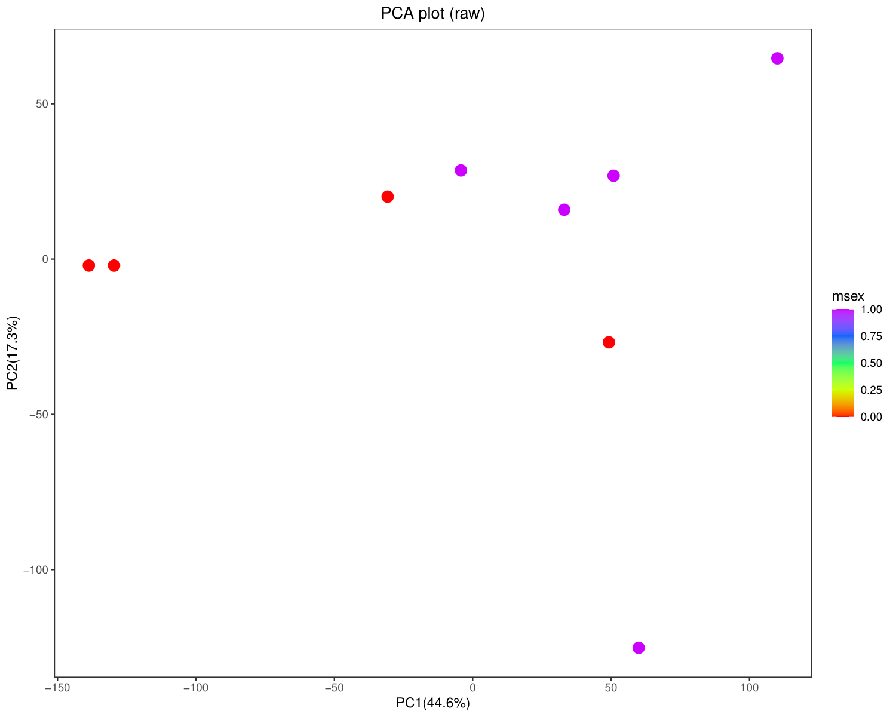 | 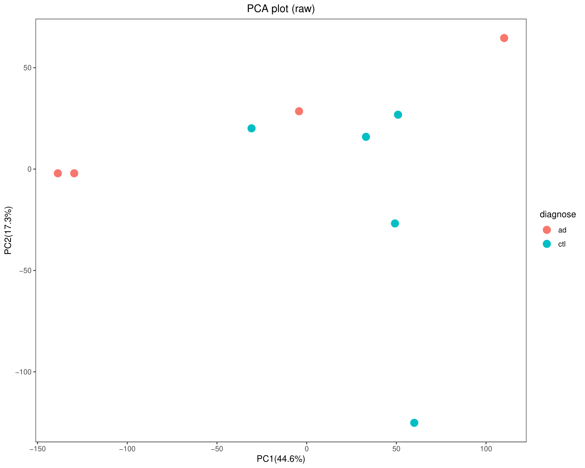 |
| CPM | 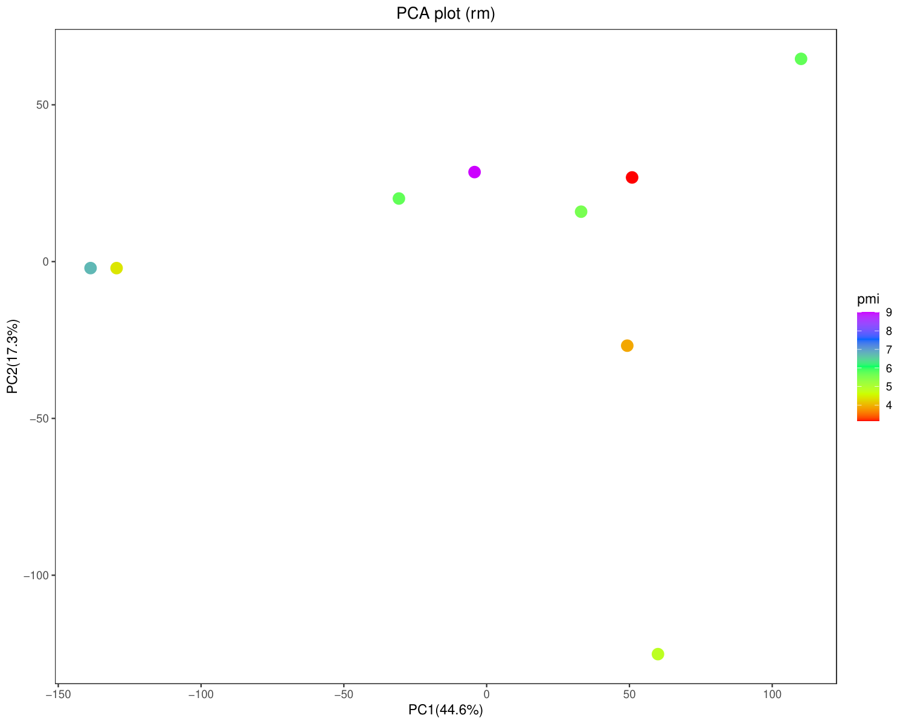 | | |
| Remove Outlier | 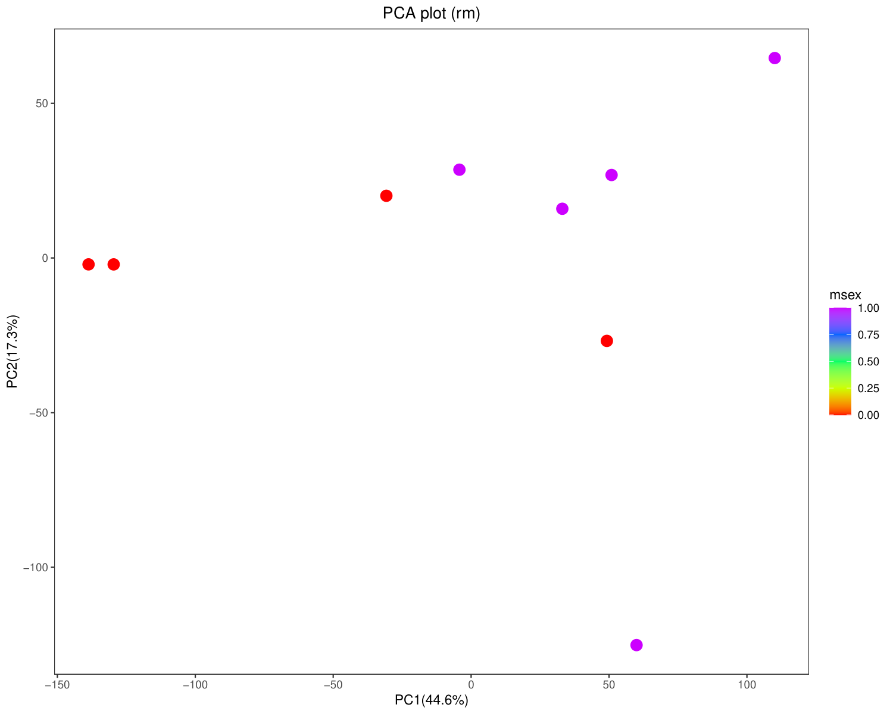 | | |
| Filter | 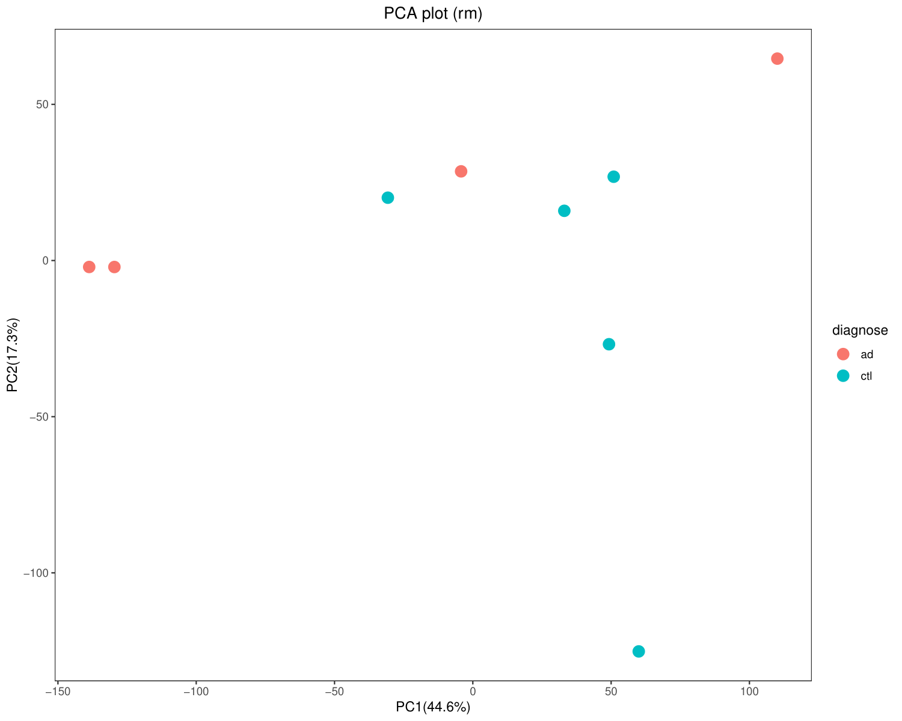 | | |
| Norm | 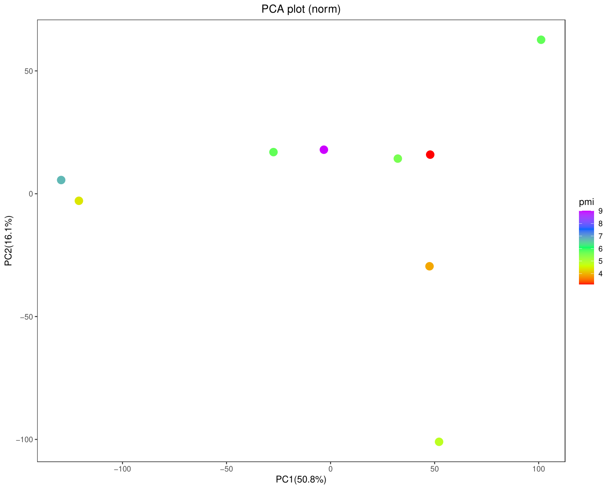 | | |
| INT | 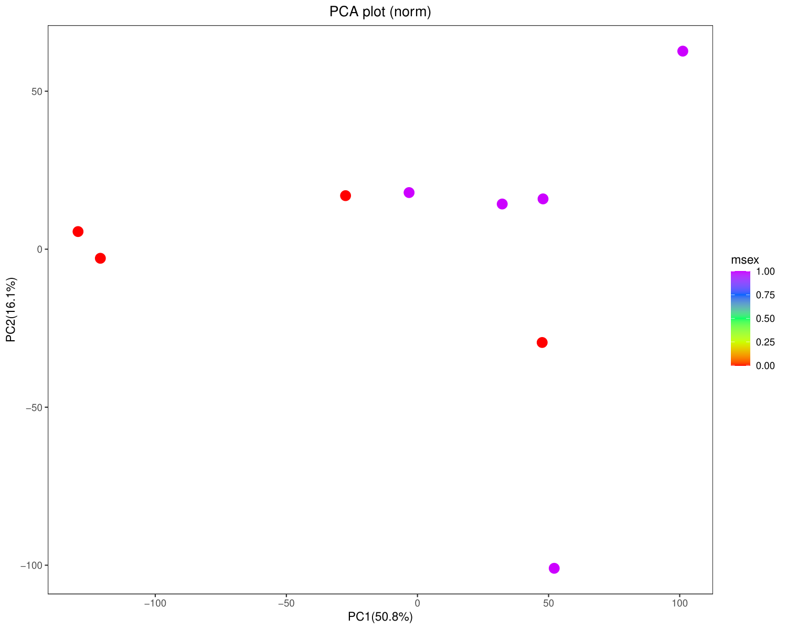 | 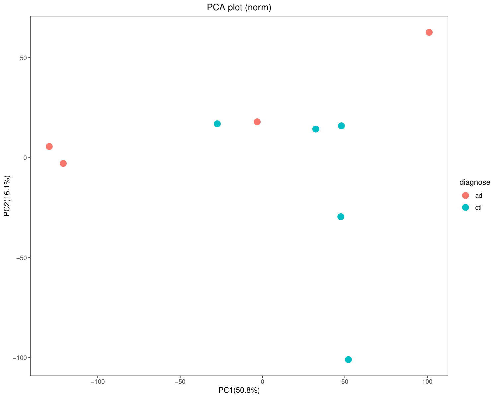 | |

*PCA图展示了不同预处理阶段样本的分布。不同颜色代表不同分组，可以观察批次效应和组间差异。*

### Step 2: 协变量校正

```r
# 清理环境
rm(list=ls()[!ls() %in% "path"])
setwd(paste0(path, "temp"))

# 设置参数
quantfile <- "tutorial_rna_log_TMM.RData"
output <- "tutorial_rna_sva"
funcdir <- path
keepvar <- "diagnose"                    # 保留的变量（分组信息）
method <- "sva"                          # 隐藏协变量方法
adjcov <- "obs&hid"                      # 校正模式
svamethod <- "be"                        # SVA估计方法
evaluate_method <- "pca&pvca&bic"        # 评估方法

# 运行Step 2
source(paste0(path, "step2_covariate_adj_R"))
```

**预期输出**：

```
-----data preprocess 2 covariate adjust----- 
--- sva: be method found 3 hidden covariance ---
- Draw covar correlation plot - 
- Draw PCA plot - 
PCA is calcluated.
pca result was saved.
pca plot was finished.
```

**关键结果解读**：

1. **隐藏协变量数量**: SVA发现了3个隐藏协变量
2. **协变量相关性热图**: `plot/tutorial_rna_sva_sva_cov_cor.pdf`
3. **PCA对比图**: 展示校正前后的样本分布变化
4. **PVCA分析**: 量化各协变量解释的方差比例

**协变量相关性热图**（校正前后对比）：

| 校正前 | 校正后 |
|:---:|:---:|
| 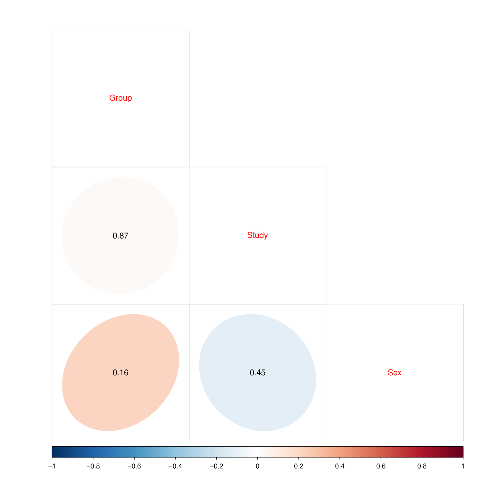 | 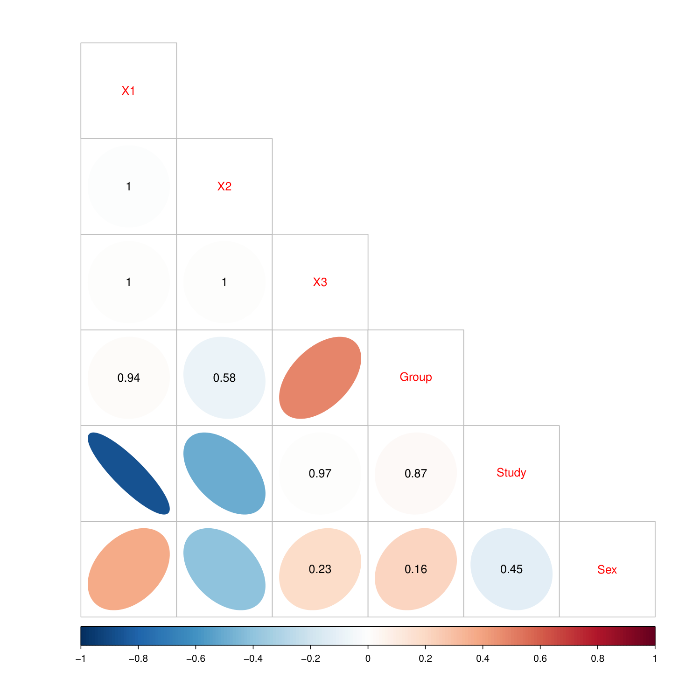 |

### Step 3: 差异表达分析

```r
# 清理环境
rm(list=ls()[!ls() %in% "path"])
setwd(paste0(path, "temp"))

# 设置参数
input <- "tutorial_rna_sva_adj_final.RData"
output <- "tutorial_rna_DEG"
grpname <- "diagnose"
groupA <- "CTL"                          # 对照组
groupB <- "AD"                           # 实验组
log2FCcut <- 1                           # log2FC阈值
adjPcut <- 0.05                          # 校正p值阈值

# 运行Step 3
source(paste0(path, "step3_DEG_classic_R"))
```

---

## 实战案例2: 含批次效应的RNA-seq分析

### 案例背景

本案例使用测试数据 `test_for_batch_adj.RData`，这是一个**多批次**的RNA-seq数据，演示完整的批次处理流程：

**数据特征**：
- 多个实验批次（Study A, B, C）
- 批次与分组不完全平衡
- 存在明显批次效应

**分析流程**：
1. 分批次进行Step 1预处理
2. 合并后评估批次效应
3. 批次校正（如需要）
4. 协变量校正
5. 差异表达分析

### 为什么分批次预处理？

**重要原则**：批次校正应该在**标准化之后**，但批次间的标准化参数可能不同（如TMM的size factor）。因此推荐：

```
推荐流程：
分批次 Step 1 (标准化) → 合并 → 批次校正 → Step 2 → Step 3

不推荐流程：
合并原始数据 → Step 1 → 批次校正（批次间标准化参数不同）
```

### 阶段1: 分批次预处理

假设数据已按批次分割为 `batch_A.RData`, `batch_B.RData`, `batch_C.RData`：

```r
# 批次A预处理
rm(list=ls()[!ls() %in% "path"])
quantfile <- "batch_A.RData"
output <- "batch_A"
funcdir <- path
step <- "234"
source(paste0(path, "step1_rna_R"))

# 批次B预处理
rm(list=ls()[!ls() %in% "path"])
quantfile <- "batch_B.RData"
output <- "batch_B"
funcdir <- path
step <- "234"
source(paste0(path, "step1_rna_R"))

# 批次C预处理
rm(list=ls()[!ls() %in% "path"))
quantfile <- "batch_C.RData"
output <- "batch_C"
funcdir <- path
step <- "234"
source(paste0(path, "step1_rna_R"))
```

### 阶段2: 合并与批次效应评估

```r
# 加载各批次预处理结果
load("batch_A_log_TMM.RData")
quant_A <- quant
covar_A <- covar

load("batch_B_log_TMM.RData")
quant_B <- quant
covar_B <- covar

load("batch_C_log_TMM.RData")
quant_C <- quant
covar_C <- covar

# 合并数据（假设基因相同）
quant_merged <- cbind(quant_A, quant_B, quant_C)
covar_merged <- rbind(covar_A, covar_B, covar_C)

# 保存合并结果
save(quant_merged, covar_merged, file = "merged_log_TMM.RData")

# 初步PCA检查批次效应
library(ggplot2)
pca_result <- prcomp(t(quant_merged), scale. = TRUE)
pca_df <- data.frame(
  PC1 = pca_result$x[,1],
  PC2 = pca_result$x[,2],
  Batch = covar_merged$Study,
  Group = covar_merged$Group
)

ggplot(pca_df, aes(x = PC1, y = PC2, color = Batch, shape = Group)) +
  geom_point(size = 3) +
  theme_bw() +
  labs(title = "PCA before batch correction")
```

### 阶段3: 批次校正（如需要）

如果PCA显示明显批次聚类，则需要进行批次校正：

```r
rm(list=ls()[!ls() %in% "path"])
setwd(paste0(path, "temp"))

# 设置参数
quantfile <- "merged_log_TMM.RData"      # 合并后的预处理数据
output <- "tutorial_batch_corrected"
funcdir <- path
keepvar <- "Group,Sex"                   # 需要保留的生物学变量
batch_name <- "Study"                    # 批次列名
method <- "combat"                       # 校正方法
evaluate_method <- "pca&pvca"            # 评估方法

# 运行批次校正
source(paste0(path, "step2_batch_adj_R"))
```

**三种校正方法对比**：

| 方法 | 适用场景 | 特点 |
|:---|:---|:---|
| `combat` | 标准化后的数据（log2） | 保持组间差异的同时校正批次 |
| `combat_seq` | 原始count数据 | 专门用于测序数据，不进行log转换 |
| `limma` | 任意数据 | 使用limma::removeBatchEffect，更灵活 |

**批次校正效果可视化**：

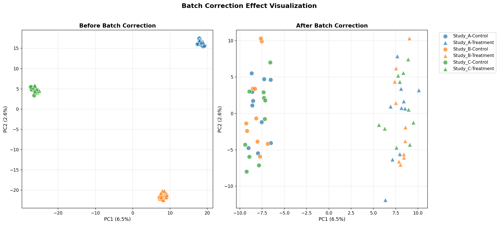

*批次校正前后PCA对比图。左图显示校正前三个批次（Study A/B/C）形成明显分离的聚类；右图显示校正后批次混合，但生物学分组（Control/Treatment）开始分离。*

**详细对比**：

| 校正前 | 校正后 |
|:---:|:---:|
| 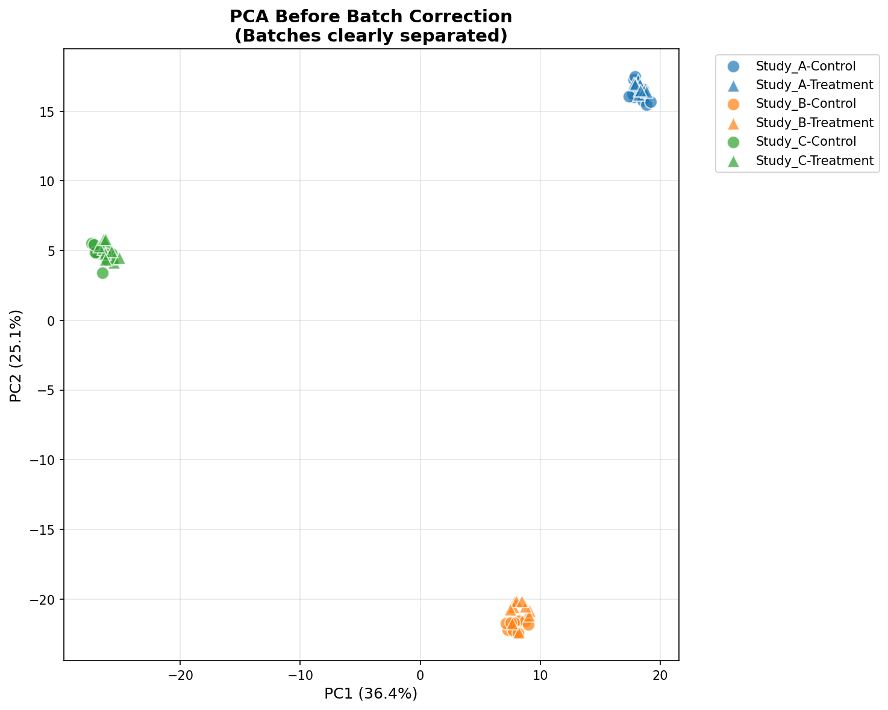 | 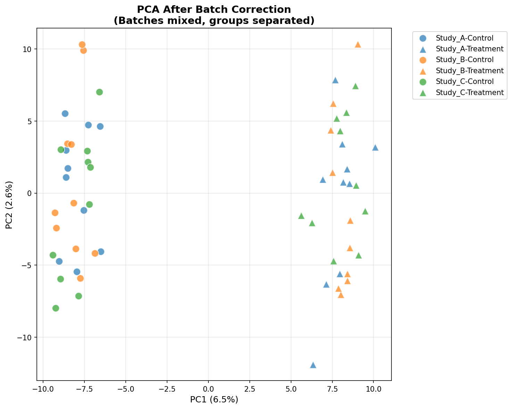 |
| 批次明显分离（按颜色聚类） | 批次混合，生物学信号保留 |

**PVCA方差组分分析**：

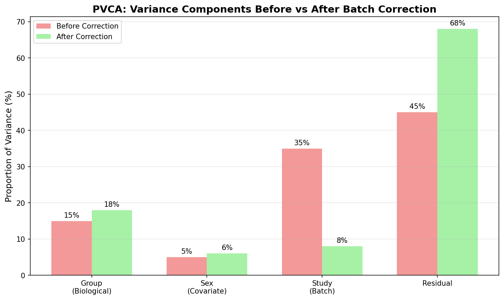

*PVCA（主方差组分分析）显示校正前后各因素解释的方差比例。校正前批次（Study）解释了35%的方差；校正后降至8%，而生物学分组（Group）的解释比例从15%提升至18%。*

**评估校正效果（代码示例）**：

```r
# 校正后再做PCA检查
load("tutorial_batch_corrected_batch_remove.RData")

pca_corrected <- prcomp(t(quant), scale. = TRUE)
pca_df_corrected <- data.frame(
  PC1 = pca_corrected$x[,1],
  PC2 = pca_corrected$x[,2],
  Batch = covar$Study,
  Group = covar$Group
)

# 对比校正前后的PCA
par(mfrow = c(1, 2))
plot(pca_df$PC1, pca_df$PC2, col = as.factor(pca_df$Batch),
     main = "Before Correction", xlab = "PC1", ylab = "PC2")
plot(pca_df_corrected$PC1, pca_df_corrected$PC2, 
     col = as.factor(pca_df_corrected$Batch),
     main = "After Correction", xlab = "PC1", ylab = "PC2")
```

### 阶段4: 后续分析

批次校正后，继续进行Step 2和Step 3：

```r
# Step 2: 协变量校正
quantfile <- "tutorial_batch_corrected_batch_remove.RData"
output <- "tutorial_batch_sva"
funcdir <- path
keepvar <- "Group"
method <- "sva"
adjcov <- "obs&hid"
source(paste0(path, "step2_covariate_adj_R"))

# Step 3: 差异表达分析
input <- "tutorial_batch_sva_adj_final.RData"
output <- "tutorial_batch_DEG"
grpname <- "Group"
groupA <- "Control"
groupB <- "Treatment"
source(paste0(path, "step3_DEG_classic_R"))
```

---

## 实战案例3: 质谱蛋白质组学分析

### 案例背景

本案例演示磷酸化蛋白质组数据的分析流程，假设数据来自**单一批次**：

### Step 0: 数据提取

```r
rm(list=ls()[!ls() %in% "path"])
setwd(paste0(path, "temp"))

# 设置参数
quantfile <- paste0(path, "testdata/phos_data.txt")
output <- "tutorial_phos"
IDinfCol <- 1:7                    # ID信息列（前7列）

# 运行Step 0
source(paste0(path, "step0_MS_R"))
```

### Step 1: 质谱数据预处理

```r
rm(list=ls()[!ls() %in% "path"])
setwd(paste0(path, "temp"))

# 设置参数
quantfile <- "tutorial_phos_raw.RData"
output <- "tutorial_phos"
funcdir <- path
step <- "1234"                     # 执行所有步骤
sdout <- 3                         # 异常样本阈值
maxNA <- 0.5                       # 最大缺失率50%

# 运行Step 1
source(paste0(path, "step1_MS_R"))
```

**处理流程说明**：

| 步骤 | 功能 | 输出文件 |
|:---:|:---|:---|
| 1 | 总强度归一化 | `_raw.RData` → 标准化后 |
| 2 | 异常样本检测 | `_rmOut.RData` |
| 3 | 高缺失率ID过滤 | `_filter.RData` |
| 4 | KNN缺失值填充 | `_impute.RData` |

---

## 实战案例4: QTL分析数据准备

### 案例背景

表达数量性状位点（eQTL）分析需要特殊的数据准备流程：

### Step 1: Count+TPM数据预处理

```r
rm(list=ls()[!ls() %in% "path"])
setwd(paste0(path, "temp"))

# 设置参数
quantfile <- paste0(path, "testdata/countTPM.RData")  # 包含count和TPM
output <- "tutorial_qtl"
funcdir <- path
min.value <- 0.1                    # TPM阈值
step <- "12345"                     # 包含INT转换
norm.method <- "TMM"

source(paste0(path, "step1_countTPM_R"))
```

### Step 2: QTL协变量准备

```r
rm(list=ls()[!ls() %in% "path"])
setwd(paste0(path, "temp"))

# 设置参数
quantfile <- "tutorial_qtl_rmOut_filter_TMM_INT.RData"
covarfile <- paste0(path, "testdata/countTPM_covar.txt")
genotype_pcfile <- paste0(path, "testdata/countTPM_genoPC.txt")
IDfile <- paste0(path, "testdata/countTPM_IDinf.txt")
output <- "tutorial_qtl"
funcdir <- path
method <- "pca"
tools <- "both"                     # 输出tensorQTL和QTLtools格式
evaluate_method <- "pca&pvca"

source(paste0(path, "step2_cov4QTL_R"))
```

---

## 文献支持与方法学说明

### 1. 批次效应检测与校正

**核心文献**：

1. **Leek et al. (2010)** - *Tackling the widespread and critical impact of batch effects in high-throughput data*
   - Nature Reviews Genetics, 11(10), 733-739
   - 系统论述了批次效应的来源、检测方法和校正策略

2. **Johnson et al. (2007)** - *Adjusting batch effects in microarray expression data using empirical Bayes methods*
   - Biostatistics, 8(1), 118-127
   - **ComBat方法**的原始文献，提供了经验贝叶斯框架

3. **Ritchie et al. (2015)** - *limma powers differential expression analyses for RNA-sequencing and microarray studies*
   - Nucleic Acids Research, 43(7), e47
   - **limma::removeBatchEffect**方法

**批次校正方法选择指南**：

| 方法 | 推荐场景 | 参考文献 |
|:---|:---|:---|
| ComBat | log2转换后的表达矩阵 | Johnson et al., 2007 |
| ComBat-seq | 原始count数据 | Zhang et al., 2020 |
| limma | 需要灵活调整时 | Ritchie et al., 2015 |

### 2. 隐藏协变量发现

**核心文献**：

1. **Leek & Storey (2007)** - *Capturing heterogeneity in gene expression studies by surrogate variable analysis*
   - PLoS Genetics, 3(9), e161
   - **SVA方法**的原始文献

2. **Stegle et al. (2012)** - *Using probabilistic estimation of expression residuals (PEER) to obtain increased power and interpretability of gene expression analyses*
   - Nature Protocols, 7(3), 500-507
   - **PEER方法**，GTEx项目使用

3. **Price et al. (2006)** - *Principal components analysis corrects for stratification in genome-wide association studies*
   - Nature Genetics, 38(8), 904-909
   - **PCA方法**在遗传学中的应用基础

### 3. 数据标准化

**RNA-seq标准化**：
- **Robinson & Oshlack (2010)** - *A scaling normalization method for differential expression analysis of RNA-seq data*
  - Genome Biology, 11(3), R25
  - **TMM方法**原始文献

**质谱数据标准化**：
- **Karpievitch et al. (2009)** - *Normalization of peak intensities in bottom-up MS-based proteomics using singular value decomposition*
  - Bioinformatics, 25(19), 2573-2580

### 4. 异常样本检测

- **Oldham et al. (2012)** - *Troubleshooting microarray analyses with network-based methods*
  - PLoS Computational Biology, 8(8), e1002634
  - **样本网络方法**（IAC/bicor）检测异常样本

---

## 最佳实践建议

### 1. 批次处理最佳实践

**设计阶段**：
- 尽量平衡批次与生物学分组
- 避免单批次只有一个生物学条件
- 记录详细的批次信息（日期、操作者、仪器、试剂批次）

**分析阶段**：
- **永远不要**在批次校正前合并不同批次的标准化参数
- 使用`keepvar`保留生物学分组变量
- 校正后必须评估校正效果

### 2. 数据预处理建议

| 数据类型 | 推荐Step | 注意事项 |
|:---|:---|:---|
| RNA-seq counts | step1_rna_R | 使用TMM标准化，保留count用于DEG_troika |
| 标准化表达矩阵 | step1_rna_R (step="23") | 跳过标准化，只做过滤 |
| 质谱蛋白组 | step1_MS_R | maxNA根据数据质量调整（0.3-0.7） |

### 3. 样本量建议

| 分析类型 | 最小样本量 | 推荐样本量 |
|:---|:---:|:---:|
| 差异表达 (t-test) | 每组3 | 每组6+ |
| 差异表达 (wilcoxon) | 每组10 | 每组20+ |
| SVA隐藏协变量 | 20 | 50+ |
| PEER隐藏协变量 | 100 | 200+ |
| 批次校正 | 每批次5+ | 每批次10+ |

---

## 总结

quantWF_2.0 提供了一套完整的定量组学数据分析解决方案。本文介绍了两种分析路径：

1. **无批次数据**：标准流程 Step 1 → Step 2 → Step 3
2. **有批次数据**：分批次预处理 → 批次效应评估 → 批次校正 → Step 2 → Step 3

关键要点：
- 分析前必须进行数据质量检查（缺失值、批次）
- 批次校正是可选步骤，仅在存在批次效应时进行
- 使用PCA和PVCA评估批次效应和校正效果
- 始终保留生物学分组变量，避免校正过度

---

*本文最后更新: 2025年3月*
